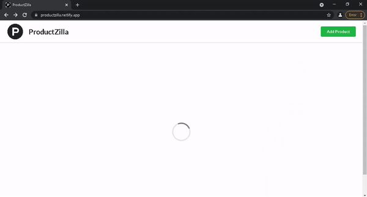

# React Product CRUD

A Product CRUD application made with React + Redux

- View **live demo** here: [productzilla.netlify.app](https://productzilla.netlify.app/)


<br />This project was bootstrapped with [Create React App](https://github.com/facebook/create-react-app).

## Prerequisites
- A modern web browser like Brave , Chrome , Firefox etc
- Node


## Getting Started

**1.** Fork [this](https://github.com/ashishbhatiam/react-product-crud) repository :fork_and_knife:

**2.** Clone your forked repository to your local system :busts_in_silhouette:

```sh
git clone https://github.com/<your-username>/react-product-crud.git
```

Or Download and extract the zip file.

### Running

1. Install NPM packages

```sh
npm install
```

2. Run

```sh
npm start
```

> Open your browser & Go to http://127.0.0.1:3000 or https://localhost:3000

## Built With

- [ReactJs](https://reactjs.org) - A JavaScript library for building user interfaces
- [Redux](https://redux.js.org) - A predictable state container designed to help you write JavaScript app
- [Semantic UI](https://react.semantic-ui.com) - A UI component framework for theming websites
### Authors

- **[Ashish Bhatia](https://github.com/ashishbhatiam)**
